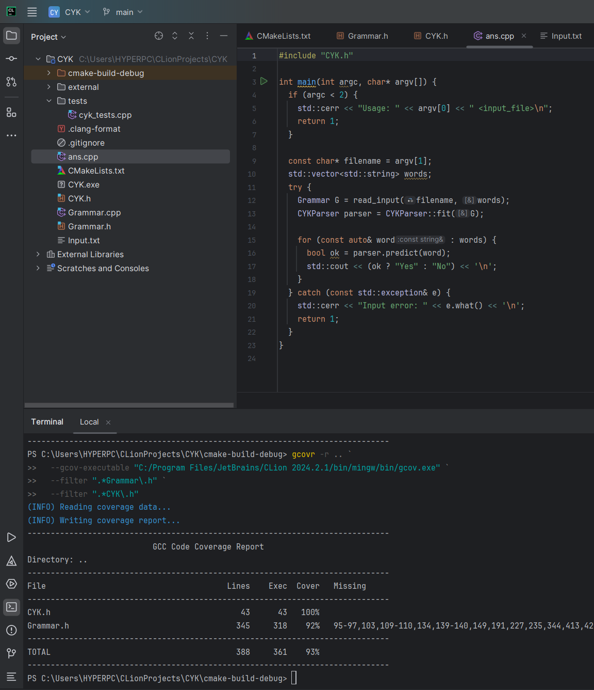

В этом репозитории находится код реализации алгоритма Кока-Янгера-Касами на C++. 
Реализация КС-грамматики и алгоритм приведения ее к Нормальной Форме Хомского находятся в файле Grammar.h,
требуемый алгоритм - в файле CYK.h, ввод и вывод находятся в файле ans.cpp. В папке tests лежит файл с тестами, у которых покрытие 93%

Для запуска нужно выполнить следующие команды:

mkdir build
cd build
cmake ..
cmake --build
./CYK "path to input.txt"

Где в файле input.txt должна лежать грамматика в формате как в условии.